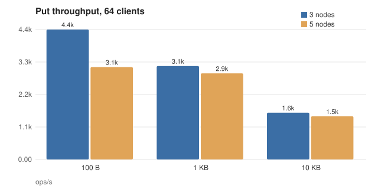
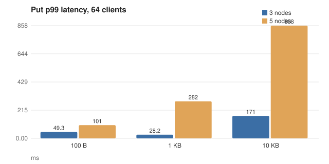
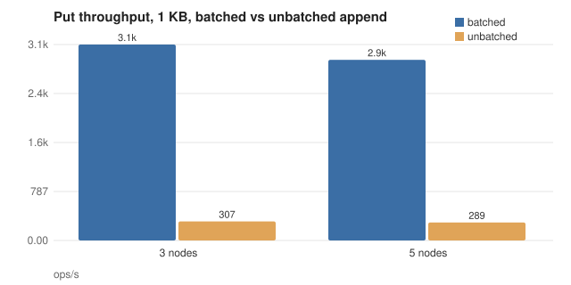
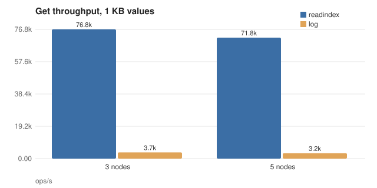
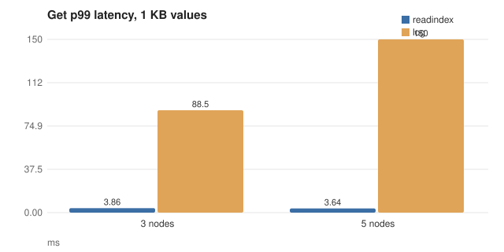
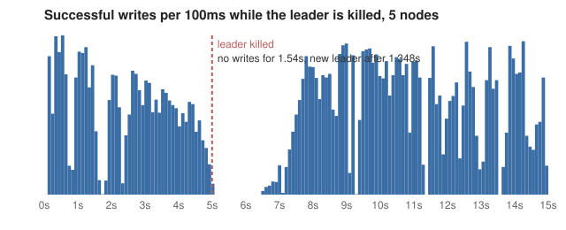

# Keystone

A distributed, persistent, linearizable key-value store written from
scratch in Go: Raft consensus on top of a custom LSM-tree storage engine,
sharded across Raft groups, with a deterministic simulator that checks
every run against Porcupine. No Raft library, no storage engine, no
hashing or skip list library; the only dependencies are gRPC, protobuf
and the Prometheus client.

```
                 keystonectl / client library
                              |
                              v gRPC, any node
   +------------------------------------------------------------+
   |  shard     hash key -> shard -> raft group, forward          |
   +------------------------------------------------------------+
   |  kv        Get / Put / Delete / CAS / Scan                  |
   |            client sessions (exactly-once), ReadIndex        |
   +------------------------------------------------------------+
   |  raft      election, replication, snapshots                 |
   +------------------------------------------------------------+
   |  storage   WAL -> memtable -> SSTables -> compaction        |
   +------------------------------------------------------------+
```

[DESIGN.md](DESIGN.md) explains how the pieces fit; [BUGS.md](BUGS.md)
lists what the simulator found.

## Quickstart

```
docker compose up -d --build
go build ./cmd/keystonectl
./keystonectl -endpoints 127.0.0.1:7101,127.0.0.1:7105 put greeting hello
./keystonectl -endpoints 127.0.0.1:7101,127.0.0.1:7105 get greeting
./keystonectl -endpoints 127.0.0.1:7101,127.0.0.1:7105 scan
```

That starts nine nodes: three shard groups of three replicas, with the
shard map in a meta group co-hosted on the first three. Any node accepts
any request and forwards it to the right group's leader. `-mode log`
switches a read from ReadIndex to a full log round trip; `shards` prints
the shard map and `move SHARD GROUP` relocates one. Metrics and pprof are
on ports 9101 to 9109. `make chaos` partitions a node and then adds
latency and loss to another while writes keep flowing.

Without Docker, the same cluster is nine processes:

```
go build ./cmd/keystone
keystone -id 1 -peers 1=127.0.0.1:7101,...,9=127.0.0.1:7109 \
         -groups "1:1,2,3;2:1,2,3;3:4,5,6;4:7,8,9" -data data/n1
```

and one group of any size is `-peers` alone.

## Testing

The interesting tests are the ones that run a whole cluster inside one
goroutine with nothing real underneath it.

**Simulation.** `sim` replaces the network with a priority queue of
messages keyed by simulated delivery time, the clock with a counter that
advances only when the loop pops an event, and the Raft log with an
in-memory journal whose unsynced tail is rolled back when a node crashes.
Every choice comes from one seeded random source, so a seed reproduces a
run exactly, and a failing run prints its seed and the last two hundred
events.

**Fault injection.** Each run draws its own message drop and duplicate
rates, delay range and clock jitter, then schedules symmetric and
asymmetric partitions with random membership and duration, node crashes
with restarts, leader-targeted kills, and torn tails that keep a random
prefix of a step's writes and none of its messages. Snapshots are forced
every forty entries and sent in 128-byte chunks, so most runs install a
few of them across partitions.

**Invariants**, checked after every event: at most one leader per term,
terms never decrease on a node, an index that any node has committed holds
the same entry on every node that commits it, every state machine applies
the same entry at every index, and a restarted node still holds everything
it had reported committed.

**Linearizability.** Three simulated clients issue gets, puts, deletes and
compare-and-swaps over a handful of keys through the real state machine,
half of the reads through ReadIndex and half through the log, retrying
with the same sequence number exactly as the real client does. The
history goes to [Porcupine](https://github.com/anishathalye/porcupine)
with a per-key register model after every run.

`TestSimMultiShard` runs the same machinery over three groups of three
nodes, with the meta group issuing sessions and two groups owning the key
space, so clients cross groups and sessions must carry between them.

```
go test -race ./sim                          # 500 seeds, chaos level 2, what CI runs
go test ./sim -seeds=10000 -chaos=3          # about 40 s on 16 cores
go test ./sim -seed=52 -chaos=2 -v           # replay one seed
```

The nightly workflow runs 50,000 seeds at the highest chaos level and
5,000 iterations of the storage crash harness. [BUGS.md](BUGS.md) lists
what the simulator has found so far.

**Crash injection.** `storage/crash_test.go` runs a workload in a child
process that acknowledges each write only after it returned, kills it
with SIGKILL at a random moment, reopens the directory and checks that
every acknowledged write is there. Two hundred iterations run in CI.

## Benchmarks

All numbers below come from `bench/results/`, produced by `make bench` on
one machine: AMD Ryzen 7 7700X, 16 threads, one ext4 volume on WSL2, Go
1.27. Every node of a cluster runs in the benchmark process and writes to
the same disk, so replicated writes pay for every replica's `fsync` on one
device, and the leader's and followers' `fsync`s contend in the same ext4
journal. That is the shape to keep in mind when reading the write rows;
the read rows never touch the disk. Sixty-four clients issue requests back
to back; each configuration ran twice for ten seconds after a two-second
warmup and the better run is kept.

### Writes




| Cluster | Value  | Keystone ops/s | p50 | p99 | etcd 3.7 ops/s | p50 | p99 |
|---------|-------:|---------------:|----:|----:|---------------:|----:|----:|
| 3 nodes | 100 B | 4,381 | 12.0 ms | 103.1 ms | 4,362 | 10.9 ms | 83.4 ms |
| 3 nodes | 1 KB | 3,150 | 12.5 ms | 198.0 ms | 3,548 | 13.3 ms | 128.4 ms |
| 3 nodes | 10 KB | 1,577 | 28.7 ms | 461.2 ms | 1,911 | 23.6 ms | 234.8 ms |
| 5 nodes | 100 B | 3,115 | 16.7 ms | 108.8 ms | 3,349 | 13.0 ms | 143.9 ms |
| 5 nodes | 1 KB | 2,904 | 18.2 ms | 146.5 ms | 4,334 | 14.4 ms | 27.1 ms |
| 5 nodes | 10 KB | 1,455 | 34.6 ms | 230.9 ms | 1,591 | 30.0 ms | 231.6 ms |

etcd was measured with its own `benchmark` tool (native gRPC, 64
connections, 64 clients, the same value sizes and key space) against an
etcd 3.7.1 cluster on the same disk; `bench/etcd.sh` is the exact
invocation. The comparison is honest in setup but not identical in path:
etcd's client library and mine differ, etcd stores values in bbolt with
MVCC on top, and Keystone's engine is an LSM tree that writes each value
twice more, once to its own WAL and once at flush. On three nodes
Keystone reaches 83 to 100 percent of etcd's throughput depending on
value size; on five nodes 67 to 93 percent, with the widest gap at 1 KB.
Repeated runs on this disk spread by about 20 percent (etcd's own
five-node 1 KB result beats its three-node one), so differences under
that are noise; the consistent part is that etcd's tail latency is
tighter, which I put down to its write path being separate from its
apply path where mine applies entries in the Raft loop.

**Batched against unbatched append.** With the batch cap set to one
entry per log append, every proposal pays its own `fsync` round instead of
sharing one with everything queued behind it:



| Cluster | Batched ops/s | p50 | Unbatched ops/s | p50 |
|---------|--------------:|----:|----------------:|----:|
| 3 nodes | 3,150 | 12.5 ms | 307 | 192.7 ms |
| 5 nodes | 2,904 | 18.2 ms | 289 | 206.4 ms |

Group commit is the whole story of write throughput here: with 64
clients, one `fsync` round carries tens of entries.

### Reads




| Cluster | ReadIndex ops/s | p50 | p99 | Log read ops/s | p50 | p99 | etcd linearizable ops/s | p50 | p99 |
|---------|----------------:|----:|----:|---------------:|----:|----:|------------------------:|----:|----:|
| 3 nodes | 76,806 | 0.7 ms | 3.9 ms | 3,700 | 14.1 ms | 88.5 ms | 39,323 | 1.5 ms | 3.5 ms |
| 5 nodes | 71,844 | 0.8 ms | 3.6 ms | 3,207 | 15.9 ms | 149.8 ms | 34,112 | 1.7 ms | 4.2 ms |

A ReadIndex read costs one heartbeat round shared by every read queued
at that moment and no disk at all; a log read is a full write round.
etcd's linearizable range is the same ReadIndex idea and lands at 39,323
ops/s on three nodes; its serializable range, which reads a local replica
with no leadership check, reaches 77,623 ops/s, which is about where
Keystone's ReadIndex sits.

### Failover



Five nodes, 64 clients writing 1 KB values, leader killed at 5.0 s. No
write succeeded for 1.74 s; a new leader was elected 1.48 s after the
kill and clients resumed without a single error surfacing, because the
client library retried through the outage with the same sequence
numbers. The election timeout is 1 to 2 s at the default 100 ms tick, so
the gap is one election timeout plus the time for the new leader to
commit its no-op.

### Storage engine alone

Single process, no replication. `fsync` means every `Put` waits for
`fsync`; `nosync` syncs on a 10 ms timer.

```
go test -run '^$' -bench 'BenchmarkPut$|BenchmarkPutParallel|BenchmarkGet' -benchtime=2s ./storage
go test -run '^$' -bench BenchmarkRecovery -benchtime=1x ./storage
```

| Workload                 | ops/s   | p50      | p99      |
|--------------------------|--------:|---------:|---------:|
| Put seq 100 B, fsync     | 617     | 1.52 ms  | 3.14 ms  |
| Put seq 100 B, nosync    | 309,518 | 1.4 µs   | 6.2 µs   |
| Put rand 100 B, fsync    | 539     | 1.59 ms  | 3.77 ms  |
| Put rand 100 B, nosync   | 168,453 | 3.4 µs   | 11.4 µs  |
| Put seq 1 KB, fsync      | 575     | 1.61 ms  | 3.28 ms  |
| Put seq 1 KB, nosync     | 99,126  | 2.3 µs   | 18.3 µs  |
| Put rand 1 KB, fsync     | 389     | 1.65 ms  | 31.3 ms  |
| Put rand 1 KB, nosync    | 78,197  | 4.2 µs   | 23.2 µs  |
| Put seq 10 KB, fsync     | 450     | 1.67 ms  | 16.2 ms  |
| Put seq 10 KB, nosync    | 11,652  | 11.0 µs  | 77.3 µs  |
| Put rand 10 KB, fsync    | 442     | 1.81 ms  | 9.85 ms  |
| Put rand 10 KB, nosync   | 9,474   | 10.6 µs  | 61.6 µs  |
| Get seq 100 B            | 443,651 | 1.9 µs   | 7.9 µs   |
| Get rand 100 B           | 369,571 | 2.2 µs   | 9.6 µs   |
| Get seq 1 KB             | 323,811 | 2.4 µs   | 12.4 µs  |
| Get rand 1 KB            | 292,806 | 2.7 µs   | 12.4 µs  |
| Get seq 10 KB            | 109,969 | 5.9 µs   | 91.0 µs  |
| Get rand 10 KB           | 103,834 | 6.4 µs   | 92.5 µs  |

Sixteen concurrent writers with `fsync` reach 3,585 puts/s at 100 B and
2,730 puts/s at 10 KB: group commit folds their writes into one `fsync`
each round, so throughput is bounded by fsync latency times the number of
rounds, not the number of writes.

Recovering a database whose WAL holds 1 GB of unflushed 1 KB writes takes
1.6 s.

Gets are served from 100,000 keys loaded into settled SSTables; the hot
set fits in the page cache, so this measures the read path, not the disk.

## Design highlights

**SSTable layout.** Data blocks hold prefix-compressed keys with a
restart point every sixteen entries; an index block maps each data
block's last key to its offset; a bloom filter over user keys sits before
a fixed 40-byte footer of offsets, version and magic. Every key carries
an eight-byte trailer of sequence number and kind, ordered so the newest
version of a key sorts first and a reader that seeks to its snapshot
sequence lands exactly on the version it may see. The byte layout is in
[DESIGN.md](DESIGN.md#sstable).

**Own-term commit rule.** The leader advances the commit index only to an
entry from its own term, however many replicas an older entry has. An
old-term entry on a majority can still be overwritten by a leader that
never saw it; only an own-term entry proves the leader's log is the one
that survives (Raft §5.4.2). A new leader appends a no-op so this can
happen without waiting for a client. The simulator's committed-prefix
invariant is what would catch getting this wrong.

**ReadIndex against log reads.** A log read is a command like any other:
one replication round and an `fsync`, ordered in the log. A ReadIndex
read records the commit index, confirms leadership with one heartbeat
round, and serves from local state once that index is applied, so it
skips the disk and the log. The benchmark above shows the gap. A
confirmed read index stays valid after the leader loses its seat, because
it names a point in the log that cannot change.

**Snapshot as SSTable export.** The state machine's snapshot is the
engine's `Export`: one sequential pass that writes the newest version of
every live key as a single SSTable. Restoring installs that file as the
only live table with a manifest write and a WAL rotation rather than a
re-insert of every key, and the same bytes restore into the in-memory
engine the simulator uses.

**Sessions.** Every command carries a client id and sequence number; the
state machine keeps the last sequence and cached result per client and
writes the session update in the same batch as the command's effects.
The client library reuses the sequence number on every retry, so a write
whose reply was lost is applied exactly once.

## Limitations and what I would do differently

- No cross-shard transactions. A key lives in one group; a scan across
  groups merges per-group results and is not one snapshot.
- No dynamic membership. Group membership is fixed at startup; the
  simplified shard move relocates data between existing groups and stalls
  writes to that shard while it runs.
- Sessions never expire, and they do not travel with a moved shard, so a
  retry that crosses a move can apply twice.
- No pre-vote and no check-quorum. A node that was partitioned away
  returns with a high term and forces one election; a leader cut off from
  its followers keeps believing until a higher term reaches it, which is
  why reads go through ReadIndex.
- Snapshots export the whole state machine, so their cost grows with the
  data rather than with the log. An engine-level incremental snapshot, or
  shipping the engine's own SSTables, would fix that.
- One goroutine applies committed entries in line with Raft message
  handling; a slow apply delays the next batch. Applying on a separate
  goroutine with a bounded queue is the obvious next step.
- The store is checked for linearizability of single-key operations;
  scans are only checked for ordering.

If I started over I would write the simulator first and grow the Raft
implementation inside it, rather than porting a working implementation
into it afterwards. The one real bug it found was a liveness problem in
the election timer that no unit test I had would have written, and it
found it on the first afternoon.
